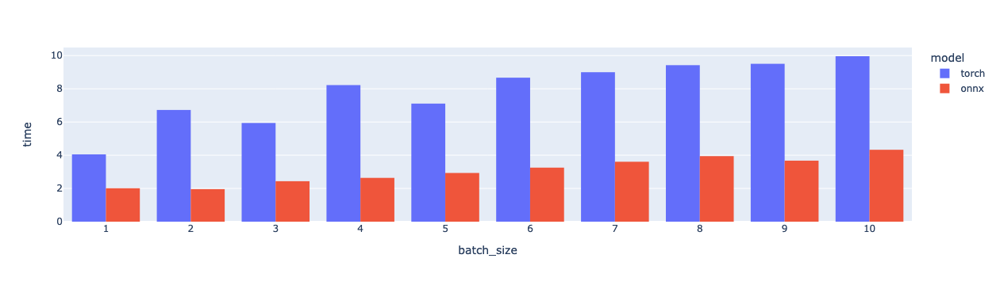

# ML Assignment

## Features

### Model Optimization

> Deploying 🤗 Transformers models in production environments often requires, or can benefit from exporting the models into a serialized format that can be loaded and executed on specialized runtimes and hardware.  <https://huggingface.co/docs/transformers/serialization>

We converted the PyTorch model to the ONNX format and conducted an experiment to compare their performance. The results shown in blue were obtained using PyTorch, and those in red were obtained using ONNX Runtime. This experiment demonstrates that ONNX can achieve over 2 times faster performance than the original model.



### Scalable FastAPI Application

In Kubernetes, our FastAPI Pod utilizes only one worker. Through Traefik as a load balancer responsible for allocating traffic to each pod, it can effectively distribute the workload to reduce each pod's workload.

### Code Quaility Assurance

We use pre-commit hooks to ensure that each git commit meets the requirement of linters like flake8 and mypy. We also write test cases with pytest to ensure the function reproducibility.

## Prepare Model Artifacts

To reduce the container size and make sure our language model can be used by all containers, we manually download the model into ./artifacts. This approach not only reduces the container image size but also facilitates sharing the language model across containers.

```bash
sudo apt-get install git-lfs
git lfs install
git clone https://huggingface.co/facebook/m2m100_418M artifacts/m2m100_418M
```

### Convert Pytorch Model to ONNX Format

```bash
python3 -m venv .venv
source .venv/bin/activate
python3 -m pip install -r requirements.txt
```

```bash
optimum-cli export onnx \
  --task text2text-generation-with-past \
  --framework pt \
  --model ./artifacts/m2m100_418M \
  --optimize O3 ./artifacts/m2m100_418M_onnx
```

## Deploy ml-assignment with Docker Compose

```bash
docker compose build
docker compose up -d
```

## Deploy ml-assignment with Kubernetes

### Launch a Kubernetes Cluster

Use k3s for its simplicity and lightweight nature, making it ideal for quick deployments.

```bash
curl -sfL https://get.k3s.io | INSTALL_K3S_VERSION=v1.28.6+k3s2 sh -
```

For detailed instructions on setting up k3s, see <https://docs.k3s.io/quick-start>

### Prepare the Container Image

```bash
# build container image with docker compose
docker compose build
# Save container image to K3s
docker save ml-assignment:latest | sudo k3s ctr images import -
```

### Apply Kubernetes Configurations

```bash
# update **hostPath** before applying volumes.yaml
kubectl apply -f ./k8s/volumes.yaml
kubectl apply -f ./k8s/deployment.yaml
```

## Development

Install development packages and set up pre-commit hooks for code quality.

```bash
source .venv/bin/activate
python3 -m pip install -r requirements-dev.txt

pre-commit install
pre-commit install -t commit-msg
```

Run the application locally.

```bash
export LLM_DIR=${PWD}/artifacts/m2m100_418M
export ONNX_DIR=${PWD}/artifacts/m2m100_418M_onnx
uvicorn app.main:app --host 0.0.0.0 --port 9527
```

### Tests

```bash
pytest tests -vvs
```
